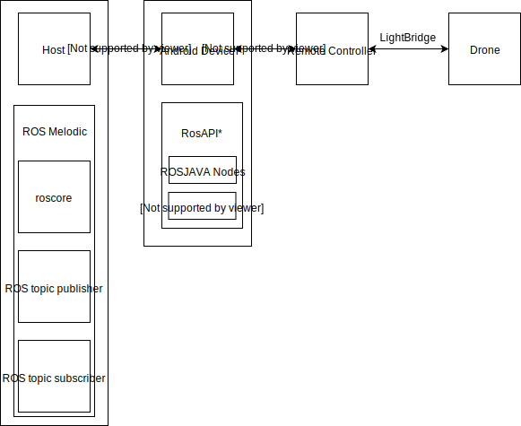
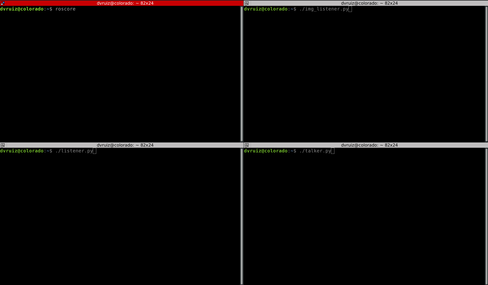

# Ros API drone Android
This project is intended as a bridge between the DJI Mobile SDK and the Robot Operating System(ROS), allowing broader use of the DJI Phantom 3 Standard drone capabilities.
<p align="center">

</p>

## Necessary Software:
* Python 2.7
* [Ros melodic](http://wiki.ros.org/melodic)
* [Rospy](http://wiki.ros.org/rospy)
* Android Studio
* [Numpy](http://www.numpy.org/) #Optional, only necessary for image streaming
* [OpenCV 2](https://opencv.org/) #Optional, only necessary for image streaming
* OpenCV-Python #Optional, only necessary for image streaming

## Recommend Software
* [Terminator](https://terminator-gtk3.readthedocs.io/en/latest/)

## Getting Started
```
git clone https://github.com/ruizvitor/RosAPIdroneAndroid.git
git clone https://github.com/ruizvitor/rosHostApi.git
```
In the Android Studio:
* Build Project
* Sync Project with Graddle Files
* Run

# Running the full system:
In the host machine:
* Open several terminal windows, one for the roscore, and one for each rostopic application 
* Connect to the drone internal wifi network
* Check your ip address using:
```
ip address
```

Illustrative layout of multiple terminal windows:


* in each terminal run
```
export ROS_HOSTNAME=yourIPhere
```
* in one of the terminals run 
```
roscore
```
In the Android device:

If it is your first time launching the app, connect to a reliable wifi connection, accept the permissions, wait for the DJI registration process to finish.
After the initial setup or in the following launches do:
* Connect to the drone internal wifi network
* Check if the name Phantom 3 Standard appears
* Click the connect button
* If your wifi configuration is rightly setup and the roscore is running in the correct ip, your ROSJAVA nodes should be operational at this point already.
* To kill the ROSJAVA nodes exit the SimpleActivity by pressing the back button

## To receive the video streaming:
in a different terminal run 
```
chmod u+x img_listener.py 
./img_listener.py 
```
or
```
python img_listener.py 
```


## To send commands to the drone / publish a message in the ros env:
in a different terminal run 
```
chmod u+x talker.py 
./talker.py
```
or
```
python talker.py 
```

## To listen messages:
in a different terminal run 
```
chmod u+x listener.py 
./listener.py
```
or
```
python listener.py 
```

# Useful Links:

* [Build and run your app in android studio](https://developer.android.com/studio/run)
* [DJI Developer Documentation](https://developer.dji.com/mobile-sdk/documentation/introduction/index.html)
* [Mobile SDK android API reference](https://developer.dji.com/api-reference/android-api/Components/SDKManager/DJISDKManager.html)

Tested on:
* Ubuntu 18.04.1 LTS
* Android Marshmallow 6.0.1
* DJI Phantom 3 Standard


